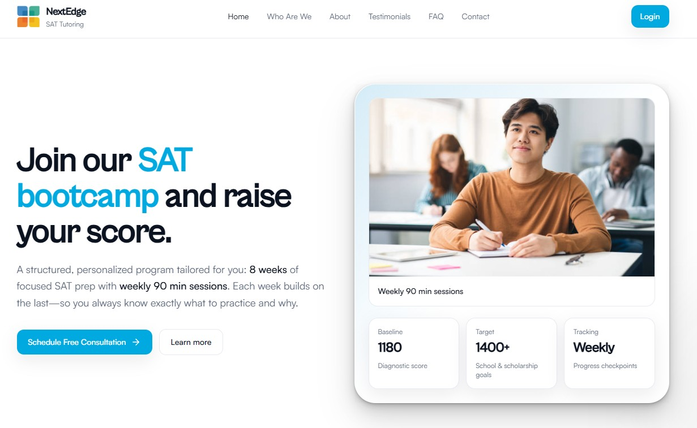

# AI-Project-Portfolio
This is a collection of all the projects I have done related to AI, Data Science, and Software Engineering. I update this on a regular basis.

**Email:** douglas.duc.ta@gmail.com

**LinkedIn:** https://www.linkedin.com/in/douglas-ta/

**Portfolio** https://douglasta2024.github.io/

**NextEdge Prep** https://nextedge-prep.vercel.app/

## Projects

### [All in One](https://github.com/douglasta2024/All-in-One)
**Tags:** Youtube, Notion, Claude, Notion, MCP, Notebook LM

**Languages/Frameworks:** Python, TypeScript, JavaScript, NotebookLM MCP

All-in-One is a modular knowledge capture application designed to convert multimedia content into structured learning resources. The current implementation features a YouTube-to-Notion pipeline where users paste a YouTube URL and automatically receive AI-generated notes organized into a Notion page. The system uses a React frontend and FastAPI backend to orchestrate a pipeline that fetches video metadata, categorizes the content, generates notes using Google NotebookLM, and writes the structured output to Notion while providing real-time progress updates through streaming events. The project is designed as an extensible hub for future tools that help automate knowledge capture and learning workflows.

### [Agentic Data Analysis Tool](https://github.com/douglasta2024/Agentic-Data-Analysis-Tool)
**Tags:** Data, Multi-Agent

**Languages/Frameworks:** Python, AI Agents, Streamlit

Agentic Data Analysis Tool is an AI-powered application that enables users to perform exploratory data analysis through natural language using an agent-based workflow. Users can upload datasets and ask questions about their data, while the system interprets the request, generates and executes Python analysis code, and returns visualizations and insights. Built with Python and Streamlit, the tool demonstrates how large language models and modular tools can automate common data science tasks such as data exploration, statistical analysis, and visualization through a conversational interface.

### [UFish](https://github.com/douglasta2024/UFish)
**Tags:** Deep Learning, CNN

**Languages/Frameworks:** Python, PyTorch

UFish is a computer vision project that uses deep learning to identify and classify fish species from underwater images. The system trains an object detection model on labeled fish datasets to detect and classify species in visual data, demonstrating how AI can automate ecological monitoring and marine research tasks. The model is optimized and trained with deployment constraints in mind so it can run efficiently on edge devices, enabling real-time fish detection in environments where cloud connectivity or high compute resources are limited. By combining dataset preprocessing, model training, evaluation, and edge-ready deployment considerations, the project highlights how computer vision can scale aquatic ecosystem monitoring.

### [AURA](https://github.com/douglasta2024/AURA)
**Tags:** Deep Learning, Multi-modal, Transformers, CNN, Electrical Engineering

**Languages/Frameworks:** Python, Arduino

AURA is a speech command classification system that enables hands-free drone control. It fine-tunes a Wav2Vec2 transformer on the Google Speech Commands dataset and exposes a Streamlit web interface for recording commands, which are then relayed to drone hardware via two ESP microcontrollers over serial.

### [Resilitree](https://github.com/douglasta2024/ResiliTree)
**Tags:** Natural Disaster Prevention, Deep Learning, CNN

**Frameworks/Languages:** Python, Pytorch

Resilitree was originally built during IBM's UF Hackathon in the Fall of 2024. The goal of this project was to assist people in need during hurricane season and increase treefall awareness in Florida. Resilitree utilizes a CNN as the backbone of the architecture to classify common Florida trees that are susceptable to treefall during hurricane season. Traits such as leaf foiliage and holes in the base of the tree are some common traits that helped Resilitree identify if a tree needed to be secured before a hurricane.

### [Fiscal IQ](https://github.com/douglasta2024/Fiscal-IQ) *---In Progress---*
**Tags:** Stock Market, NLP, RAG, Web Scraping

**Frameworks/Languages:** Python, JavaScript, Google ADK, React, Selenium

FISCAL IQ is a personal finance intelligence tool that combines a stock portfolio tracker with AI-powered news aggregation. Users can manage portfolios, track live stock prices, and fetch curated financial news — optionally piped into Google NotebookLM for deeper AI-driven research.

